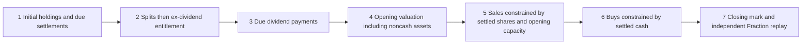

# Synthetic Vibe accounting bridge

The bridge extends a locally installed US-equity engine without modifying its source. It is a declared long-only USD model for synthetic fixed-target acceptance. It does not claim that a broker follows these settlement or entitlement assumptions.

## Declared semantics

- Opening holdings are already settled. First-bar marks are explicit inputs, not fills.
- Settlement delays count supplied calendar sessions, not elapsed calendar days. Sale net proceeds enter pending cash; only their due settlement makes them available for buys. Bought shares count in equity immediately but cannot be sold before their settlement session.
- Splits run before dividend entitlement on a shared effective date. Both held and locked share quantities change together; compressed position cost per share changes inversely. Fractional entitlements/cash-in-lieu are rejected.
- Ex-day entitlement uses holdings before that day's fills, including bought shares still awaiting settlement. Sale on the ex-date retains the entitlement; purchase on the ex-date does not receive it. Net receivables include explicit withholding and enter equity immediately; payment alone adds available cash. Entitlement after a special due-bill event is outside this simple model.
- Ending before a pay/settlement date preserves a noncash asset. Positions remain marked, with no invented terminal liquidation. The native engine's final forced-cash overwrite is replaced with the actual preceding account mark.
- Two native planning passes commit permitted sales first, then plan buys against remaining settled capital, using the same observable opening equity. A missed target is not retried without a new declared decision. Native common-factor basket fitting remains its own allocation model; these21 small cases do not prove equality to the reference for all multi-asset baskets.
- Fills remain native engine records. Separate account events and actual capital/position snapshots feed an independent Fraction replay using raw prices, opening state, fees and actions. This replay calculates its own equity; its value is never substituted for engine equity. Engine and account snapshots are cross-checked as well.

## Supported scope and remaining gaps

One-share lots, USD0.01 price ticks/fee quantum, no leverage/shorting, no cash interest/FX, known opening quote time/status/capacity, explicit USD fees, integral splits and ordinary declared post-split cash distributions. The input contract still requires `synthetic_fixture` and refuses real historical data. Changed tick/lot grids are unsupported rather than silently treated as this market.

Initial capital for performance analysis must include starting securities; this extension tests accounting only and does not call the native performance calculator. Full strategy signals, signal-vs-trade share basis, multi-asset fee/capacity fitting, real provider adjustments and historical calendar timing are later gates.

The native engine stores floating-point state; the current integer/simple-decimal hand-answer controls have exact representable results. Independent replay uses exact fractions with its strict reference tolerance. Arbitrary historical decimals may expose rounding differences requiring an explicitly tested, registered monetary tolerance; these controls do not certify arbitrary precision.

The offline socket guard prevents common outbound connection calls during these controls. It is a bounded instrument guard, not operating-system network isolation. No loader/broker method is called and no dependencies are installed.
