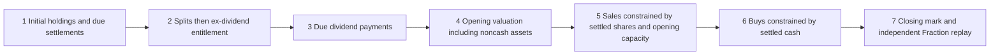

# Synthetic Vibe accounting bridge

The bridge extends a locally installed US-equity engine without modifying its source. It is a declared long-only USD model for synthetic fixed-target acceptance. It does not claim that a broker follows these settlement or entitlement assumptions.

## Declared semantics

- Opening holdings are already settled. First-bar marks are explicit inputs, not fills.
- Settlement delays count supplied calendar sessions, not elapsed calendar days. Sale net proceeds enter pending cash; only their due settlement makes them available for buys. Bought shares count in equity immediately but cannot be sold before their settlement session.
- Splits run before dividend entitlement on a shared effective date. Both held and locked share quantities change together; compressed position cost per share changes inversely. Fractional entitlements/cash-in-lieu are rejected.
- Ex-day entitlement uses holdings before that day's fills, including bought shares still awaiting settlement. Sale on the ex-date retains the entitlement; purchase on the ex-date does not receive it. Net receivables include explicit withholding and enter equity immediately; payment alone adds available cash. Entitlement after a special due-bill event is outside this simple model.
- Ending before a pay/settlement date preserves a noncash asset. Positions remain marked, with no invented terminal liquidation. The native engine's final forced-cash overwrite is replaced with the actual preceding account mark.
- The v0.3 planning hook fixes raw-open target quantities, commits permitted sales first, then buys sequentially in SPY/EFA/IEF/GLD order using fee-aware settled-cash sizing. Native order commit, position, fill, bar-loop and valuation hooks remain in use. Prior20 supplied session volumes bound capacity at0.1%; the current full-day volume never sizes an opening order. A missed target is not retried without a new declared decision.
- A missing opening quote uses the last known account mark for opening equity and cancels that symbol's order. It cannot substitute the same day's future close; splits adjust the stored prior mark before valuation. Missing closes preserve the last known split-adjusted mark.
- Fills remain native engine records. Separate account events and actual capital/position snapshots feed an independent Fraction replay using raw prices, opening state, fees and actions. This replay calculates its own equity; its value is never substituted for engine equity. Engine and account snapshots are cross-checked as well.

## Supported scope and remaining gaps

One-share lots, USD0.01 price ticks/fee quantum, no leverage/shorting, no cash interest/FX, known opening quote time/status/capacity, explicit USD fees, integral splits and ordinary declared post-split cash distributions. The input contract still requires `synthetic_fixture` and refuses real historical data. Changed tick/lot grids are unsupported rather than silently treated as this market.

Initial capital for performance analysis must include starting securities; the project uses its own registered metrics and does not call the native performance calculator. The separate synthetic protocol controls now generate full project signals/baselines and sequential allocation; real provider adjustments, historical timing and account/FX acceptance remain gates.

The native engine stores floating-point state. The adapter declares USD1e-8 for cash/equity-state replay and the same planning quantum. Other event prices/fees retain the strict reference tolerance, integer quantities and nonnegative economic funding remain exact checks. Tests accept a5e-9 valuation representation difference but reject1e-6; penny errors cannot be hidden by this tolerance. The reference's default tolerance remains1e-20. This is a numerical model contract, not arbitrary-precision certification.

The offline socket guard prevents common outbound connection calls during these controls. It is a bounded instrument guard, not operating-system network isolation. No loader/broker method is called and no dependencies are installed.
