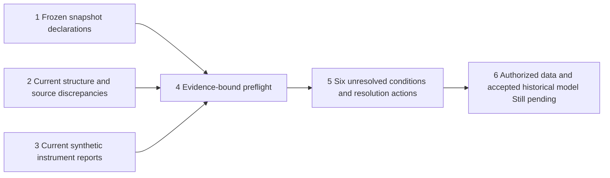

# Historical study preflight, v1

Each successful validation run writes `historical_preflight.json`, included in its scientific fingerprint and immutable evidence seal. The report is an explicit remaining-conditions deliverable; it is not a historical return trial, legal authorization or executable account certificate. This foundation version has no accepted historical input adapter, nonzero cash-yield/FX path or completed historical benchmark study. `historical_run_permitted` remains false. Setting an input manifest's `historical_ready` or an assumption's status to verified cannot implement those features or certify external facts.

## Six conditions, without silently clearing the old snapshot

| Gate | Current evidence may establish | Remaining evidence or implementation |
|---|---|---|
| D01 Source rights | Frozen bytes and recorded restriction statements | Provider-specific rights for acquisition, analysis, storage and output distribution; a reachable URL is insufficient |
| D02 Prices and volumes | Structure, coverage and cross-source disagreement counts | Primary authorized definition, revisions, price/share/volume mapping and opening-execution definition; no averaging or silent patching |
| D03 Calendar and timing | Session-date checks and explicitly assessed receipt fields | Historical intraday hours, original receipts/revisions or a frozen conservative availability/delay model |
| D04 Corporate actions | Issuer distribution parsing and synthetic gross/net/split controls | Historical raw-versus-signal units, entitlement/payment and share normalization; no double counting an already adjusted price |
| D05 Account and currency | Registered synthetic assumptions | Effective-dated fees/taxes, FX, cash yield, settlement, integer units and adverse scenarios; no implicit zero values |
| D06 Historical study path | Accepted reference, adapted actual-Vibe, metric and causal synthetic-path controls | History conversion, all101 development risk accounts, registered historical windows/scenarios and paired monthly inference |

The old manifest remains an immutable record. A D06 `not_run` declaration is shown alongside this run's newer synthetic evidence. Even when all expected control reports pass, D06 is only `PARTIAL_SYNTHETIC_ACCEPTANCE`; this does not clear the historical gate. Missing optional Vibe reports are shown as absent with null counts, not zero failures. Per-case differences/replay records, unique case identities and both causal-control results are checked rather than trusting an acceptance label alone. These consistency checks still depend on their evidence-producing instruments.

The first preflight parser incorrectly required an empty differences field on every row, including expected rejections, injected-error detection and summary-only risk-grid controls. That report-reader fault was corrected by checking each declared outcome form and integration-testing real producer reports. Earlier sealed development runs remain retained; their preflight control undercounts do not describe an engine regression. The risk-grid row remains a producer summary backed by separately sealed101-account artifacts, not an independent second calibration.

## Source-use review, 2026-10-04

[Yahoo terms](https://legal.yahoo.com/us/en/yahoo/terms/otos/index.html?.intl=us&.lang=en-au) require prior express permission for automated collection. Their general API terms do not by themselves establish that an undocumented Finance chart endpoint is licensed for this use. No Yahoo permission grant was verified here.

[Nasdaq website terms](https://www.nasdaq.com/legal), marked updated May11,2026 when inspected, restrict collection and using website content for data-analysis software without written permission. Nasdaq Data Link is a separate product with its own license/order terms; a website response or product availability cannot be substituted for an applicable license. No grant was verified here.

[GLD website terms](https://www.spdrgoldshares.com/terms-and-conditions/) permit certain personal noncommercial saving/display/printing, with wider use and money-making purposes subject to written consent. This limited permission is not assumed to cover an automated trading-research dataset or public redistribution. The correct permitted scope still needs confirmation.

The direct Yahoo terms request initially returned HTTP999; an official Yahoo search result exposed the terms. That transport observation is not evidence that the license was granted or refused. This review records applicable-source questions; it does not infer a universal prohibition on quantitative research or discard a source that could provide an appropriate grant.

## Conditional assumptions and output privacy

A declared conservative daily execution/availability/account model can support a future conditional study when use rights and units are accepted. It cannot replace source permission, fix unexplained unit errors, establish intraday fill quality or turn already inspected historical windows into pristine future evidence. The current report names those possibilities without claiming that the model or study has run.

Snapshot-attached preflight reports contain source diagnostics, metadata and issuer-action details. Like raw/normalized inputs, they remain outside the public export by default. Only the generic code, synthetic controls and this method are public. Report fingerprints bind the reviewed observations; hashes do not prove source accuracy or rights.

The receipt audit previously returned0 for Nasdaq even though that path did not inspect receipt timestamps. It now emits `received_timestamp_check=not_checked` and a null missing count. Previously sealed reports are retained; their zero must not be read as no missing historical receipts. Yahoo receipt-field checks are reported separately and remain insufficient to certify original availability.
