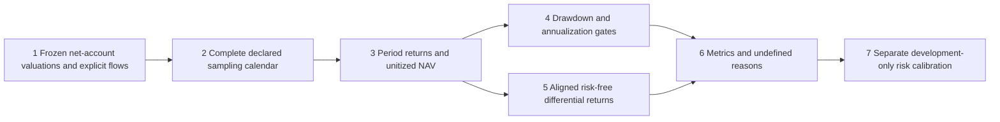

# Performance contract v1

This module diagnoses a complete net-equity ledger. It does not certify a data source, a strategy, accounting correctness, broker execution or historical independence. The public controls are synthetic, with invented calendar and risk-free data.

## Frozen definitions

| Item | Definition and limitation |
|---|---|
| Opening value | Whole net account including held securities, cash, receivables and liabilities; opening funding already included. Explicit valuation boundary precedes measured closes. Initial construction fees belong in subsequent net equity. |
| Flow timing | External contributions/withdrawals occur after the interval's valuation. Return `r_t=(V_t-F_t)/V_(t-1)-1`; chain the returns. This is exact for the declared end-boundary flow model, not an approximation for intraday flows. Intraday flows require additional valuation boundaries and are outside this date-only API. |
| Return/profit | Chained unitized NAV gives period return. Monetary profit is final value minus opening value minus net external flows; the two measures differ with flows. No cash sleeve is removed or renormalized. |
| CAGR | Calendar elapsed days, ACT/365: `NAV_end^(365/days)-1`. Windows below365 days and insolvency have no CAGR. This registered convention is not a universal standard; leap years affect the exponent. |
| Volatility | Sample standard deviation of all periodic net returns (`ddof=1`) times `sqrt(252)` for daily-session sampling or `sqrt(12)` for monthly sampling. At least two returns required. |
| Sharpe | Sample mean of aligned periodic excess returns divided by their sample standard deviation, times the same square-root frequency. The denominator is excess-return variability, which matters when risk-free returns vary. Currency, endpoints and source must be explicit; missing risk-free returns are not filled with zero. |
| Drawdown | Positive magnitude `1-unit_NAV/running_peak`, including opening value. Calendar-day and observation durations run from the most recent equal/new peak through recovery or the last observed boundary; unrecovered episodes remain labeled. Close sampling cannot measure intraday drawdown. |
| Calmar | Full-window net CAGR divided by the same-window maximum drawdown. Zero drawdown or undefined CAGR gives null with a reason, not infinity; a negative CAGR keeps a negative ratio. This is explicitly a full-window convention, not a trailing36-month series. |
| Turnover | Total absolute buy plus sell fill notional divided by arithmetic mean of all supplied account valuations, including opening value. Two-sided, not half turnover; annualized by365/days only for windows at least365 days. Flow-heavy accounts change this economic denominator and should be compared carefully. |
| Costs | Actual fill commission/platform/tax plus separate dated other/FX/fixed/tax events. Fill components must equal total fees; event IDs are unique. Costs are already in net equity and are disclosed without subtracting them twice. Embedded price slippage cannot be estimated from fee sums. |
| Insolvency | Retain the return at or below−100%, the insolvency date and all following observations. Do not drop it or recapitalize into an uninterrupted winning curve. Later returns with nonpositive starting equity are undefined. A full external redemption of otherwise positive assets is distinguished from bankruptcy. |

Square-root scaling is a descriptive annualization convention; it is not a correction for serial dependence. A short sample's risk ratio can be reported as a diagnostic with an explicit warning, while its CAGR remains suppressed. The original [Sharpe1994 discussion](https://web.stanford.edu/~wfsharpe/art/sr/SR.htm) defines differential returns and explains the time-dependence assumptions. The exact calendar, CAGR, drawdown and turnover conventions above are choices of this project, not claims of certification by that paper.

## Comparability and risk-matched benchmark

`calibrate_risk` accepts **101 separately generated account ledgers**, keyed k=0.00…1.00. All must share resolved development boundaries, currency, sampling, opening capital, no external flows, and frozen comparison-context hashes for data, account, costs, execution and FX. Context identifiers detect mismatched declarations; upstream evidence must establish their contents. It does not fabricate BR by multiplying an existing return series by k, which would ignore monthly rebalancing, fees, integer shares, settlement and FX.

Select the smallest absolute gap to strategy annual volatility, using a numerical tie quantum of1e−12 absolute annual volatility and lower k on ties. Keep all101 points. No mean return, CAGR or Calmar enters selection. Relative risk error above10%, zero/undefined strategy volatility, or an undefined candidate prevents a risk-matched claim. Preserve the selected k for other windows/cost/capital scenarios; never recalibrate on confirmation or forward data.

The synthetic grid control only checks this selection algorithm. **Actual BR account generation, RMB FX accounting, full four-ETF strategy evaluation, monthly paired log-growth/bootstrap inference, beta/exposure attribution and forward evidence remain pending.** A conditional USD study must be labeled as such, not as the protocol's executable RMB personal account.

## Instrument evidence

The common CLI always runs12 known-answer metric/calibration controls and4 bad-input rejections, with inputs and outputs archived and included in the scientific fingerprint. A disposable source-copy mutation that treats a deposit as profit produces a semantic mismatch, while the original source stays unchanged. Separate Fraction arithmetic verifies sample variance/returns.

The21 Vibe accounting controls also normalize their actual account events/valuations into this metric API and compare net return with hand-answer whole-account outcomes. Their opening boundary is an explicitly invented2024-10-04 valuation; it is not exchange-calendar evidence. With an existing Vibe interpreter, use the same public test command; no automatic installation occurs.
