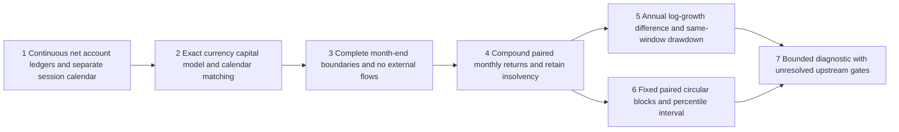

# Paired monthly account inference, v1

The S02 protocol fixes the statistic as12 times the mean paired monthly log-growth difference,12-month circular blocks,2,000 resamples,seed20261003, a90% interval, and at least60 complete paired months per evaluation window. This implementation refines previously unspecified mechanics to a percentile interval with linear empirical quantiles at zero-based `(N-1)*p` (type7), truncating the final circular block to exactly the original sample length. These choices are frozen method definitions, not parameters selected from market returns. No historical study has run.

## Account and timing contract

`paired_monthly` consumes two complete account ledgers compatible with `performance.report`, a resolved boundary/end, an explicit consecutive list of month endpoints, and a separate ordered session calendar. Currency, sampling, opening capital, calendar source, full valuation calendar and five data/account/cost/execution/FX context hashes must match. The hashes identify declared models; they do not certify their contents. Every external flow must be0; contributions and withdrawals cannot hide behind a zero net sum.

The session calendar covers the opening boundary and extends into a month after the evaluation end. Each declared boundary is the last supplied session in its month. Daily ledgers must contain every declared session valuation in their full measured interval; monthly ledgers must supply every requested month without an intramonth extra. A missing month on both sides still fails. The supplied calendar itself needs separate market acceptance; invented civil/sparse calendars in tests do not certify real exchange dates or special closures.

The underlying accounts stay continuous. Reporting a subwindow does not liquidate/reset holdings, credit new funding, forgive fees or recalibrate the benchmark. Window drawdown starts its diagnostic NAV at1 at the explicit preceding-month boundary and compounds that window's returns at the ledger sampling frequency. This is the same-window drawdown definition, not a claim about the uninterrupted account's all-history maximum drawdown. Daily/close sampling still misses intraday drawdowns.

For a month with daily returns, use the product of `(1+r_day)` minus1, not their sum. Wallet values already include net costs, taxes, receivables and whatever supported currency/cash model produced them; this module does not charge those costs again. Monthly log differences are `log(1+r_S)-log(1+r_B)`. Annualized Δg is12 times their mean; it is not the difference between two CAGRs or a forecast of cash profit. Decimal calculations use50 digits; both decimal strings and finite numeric summaries are recorded.

All month rows are retained. Any insolvency at or before the window end, including before the selected boundary, prevents an uninterrupted growth/inference claim. At/below−100% returns and subsequent undefined observations are reported, not dropped or recapitalized into a new winning curve. Fewer than60 complete months may have a descriptive point but no bootstrap interval. Zero degenerate intervals from identical accounts are explicit controls, not evidence of a superior investment rule.

## Paired circular blocks

Compute the difference series once and resample it jointly, preserving strategy/benchmark pairing. Draw uniformly from start indices0…N−1 using `random.Random(20261003)`, concatenate contiguous12-month blocks with end-to-start wrapping, and truncate the last block to N total months. Summarize each draw as12 times its mean difference. Archive every block-start row and every decimal draw statistic; an index hash supports replay. Python/runtime/source versions are frozen in the containing run because RNG implementation changes must not silently alter an experiment.

The interval is the5% and95% empirical quantile of the2,000 annual log-growth draws. Type7 linear interpolation is fixed. The [R quantile documentation](https://stat.ethz.ch/R-manual/R-devel/library/stats/html/quantile.html) describes quantile definitions; it does not endorse this strategy or interval choice. The [Politis discussion of bootstrap methods for time series](https://mathweb.ucsd.edu/~politis/impactBOOT.pdf) explains dependence-aware resampling and its assumptions. A fixed block length and many resamples do not create new independent market observations. Nonstationarity, selection after inspecting results, multiple comparisons and model/data errors are not eliminated by this interval.

The output separately records a positive growth point, no deeper drawdown, sufficient months and interval direction. No single-window flag is called full strategy support. The frozen study still needs accepted inputs and risk calibration plus all validation/confirmation, capital and cost/delay scenarios. Those windows are historical diagnostics when already inspected, not pristine independent future evidence.

## Bounded instrument evidence

Every common CLI run archives six invented account controls and four rejected bad inputs. Known answers cover identical volatile accounts giving exactly0 paired differences, positive/negative constant growth, fewer-than60 months, insolvency with all60 rows retained, and daily net compounding with a50% intermediate drawdown despite positive monthly growth. The six controls are not six strategies or a market backtest.

Tests replay all2,00061-month bootstrap draws and interval endpoints with independent Fraction arithmetic and explicit sample positions, including wrapping and the truncated tail. Separate literal quantiles test interpolation. Future account valuations are perturbed after a frozen60-month window: monthly results/interval stay unchanged while full input provenance hashes change. A disposable source copy that adds rather than subtracts benchmark log growth runs normally but fails known semantic answers; original source remains unchanged.

An optional actual-Vibe test sends S and BR synthetic full-path account evidence through the net-account bridge to the paired API. It produces one complete month and correctly refuses to promote it into a60-month inference result. This verifies that particular integration; it does not provide60 months of actual engine/market evidence, historical BR calibration or coverage certification.

Real ledger/monthly/interval outputs can disclose private strategy behavior and stay outside public Git by default. The public repository contains generic code, invented controls and this method only.
