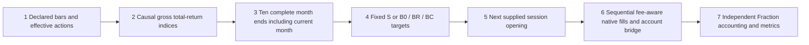

# Frozen synthetic four-asset path, v0.3

The fixed synthetic universe is SPY/EFA/IEF/GLD. The strategy starts each gross signal index at100 and updates using split ratio times `(close+gross distribution)/previous close`. Only actions effective that day enter; late effective information is rejected. Wallet entitlement/payment/withholding is separate. Missing close data permanently breaks that signal chain rather than silently spanning a gap.

S compares each current gross index with the equal-weight mean of the latest10 complete month-end indices, including the current month. Greater gives25%, equality/below gives0; other weight stays in cash. Nine months cannot generate a trend intent. B0 has25% each; BR hask/4 each with a predeclared hundredth-grid k; BC has0% risky weights. A broken trend feature does not suppress the unrelated fixed benchmark rule. All variants use the declared information-timing check. The resolved first trade session excludes pre-start decisions whose execution precedes that session; an eligible preceding-close decision may trade on the first session.

The chronological feature function uses independent rational arithmetic and emits timed decisions. Those targets go through the installed Vibe bar loop, its next-bar alignment and explicit one-shot decision calendar, then the account bridge. The bridge's planning hook follows the frozen sequential funding rule; it does not use native common-factor basket fitting. Native order commit, fills and positions remain the execution state. This is the project's full protocol pipeline; it does not certify an upstream native SMA implementation.

## Discriminating hand answers

- USD104, four25% targets, prices13, per-order fee2: hold2/2/2/1, cash5, equity96. A common basket scale may produce different holdings while showing the same equity; positions and fills must be checked.
- USD100 plus10 GLD shares marked10, missing GLD opening quote followed by close1000, SPY25% target: buy5 SPY, not a quantity sized from the future close. GLD's order cancels; its later mark remains in equity.
- Previous20 volumes of10 and current full-day volume1billion: opening capacity screening remains0; future volume cannot rescue a fill.
- Price10 with1% adverse execution and1% commission: buy9 at10.10, fee0.91, final cash8.19 and equity98.19. Binary representation is reconciled within the registered USD1e-8 state tolerance.
- Sparse invented monthly path: SPY rises, EFA is exactly flat, IEF falls, GLD rises. S holds12/0/0/8 and cash520; B0 holds12/25/12/8 and cash30; BR k=.50 holds6/12/6/4 and cash520; BC keeps1000 cash. These are formula/account controls, not market returns.
- A gross SPY distribution produces signal index200, while a20% withholding wallet finishes1080; an integral split alone keeps its index100 and cannot create momentum.

Each common CLI run archives11 cases and2 causal comparisons (prefix truncation; future price/action changes). The reference runs by default and the actual installed engine runs when Vibe controls are requested. Tests deliberately change strict comparison to include equality in a disposable source copy, and deliberately use a future close for opening valuation through an actual engine subclass. Both produce semantic differences without changing original source.

The first added gross/net unit assertion compared formatting (`1080.0` versus `1080`) rather than monetary value; it was corrected to a Decimal comparison. That test fault is not engine-performance evidence.

## Remaining gates

Invented sparse sessions are not exchange-calendar certification. All normal, half-day and historical receipt times, vendor price/share adjustment basis and use rights still require evidence. Current inputs must be `synthetic_fixture`; real history is explicitly refused until a separately accepted conditional-study contract exists. BC0 interest is a model control, not an available personal cash yield; nonzero cash interest/FX and real account conditions remain unsupported. One BR coefficient in a control is not a completed101-account historical development calibration. Historical scenario/window reporting, paired monthly inference and genuine forward records remain pending.
