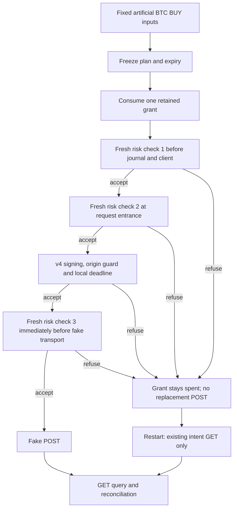

# Offline dispatch risk rechecks, version 2

Version 2 adds three checks of fresh artificial risk, wallet and quote observations around an already frozen BTCUSDT BUY plan: after durable signal consumption, at the order request entrance, and immediately before the in-process fake transport. It keeps price, quantity, client identity and expiry fixed. A local refusal consumes the existing permission conservatively; restarting queries and reconciles the existing intent without a new POST.



The diagram covers the closed in-process fixture and retained local files. A refusal after order reservation also leaves that reservation spent; absent reservation, recovery cannot create one.

The closed fixture uses an artificial USDT capital of 50 and floor of 30. Both current equity and fee-inclusive projected equity must be strictly above the floor; an exact boundary is refused. Freshness is at most 5,000 ms with nonfuture, nonregressing clocks; equity and exposure use exact Fraction arithmetic and the latest reference. Quote drift is at most 1%, gross notional and projected BTC exposure are each at most 25, and fees are reserved in USDT only. Slippage is embedded once in the fixed limit. Captured account-wallet evidence must still match the current closed BTC/USDT snapshot. These are fixture conditions, not a real account or currency-conversion risk policy.

The [bridge source](../tools/binance_signal_order_bridge_20261008_v2.py) is an exact copy with SHA256 d6878ee61787c973edb851f2a061b0ddbecea1c79cd023230e8ae2496133952a. Its [producer controls](../tools/test_binance_signal_order_bridge_20261008_v2.py) retain SHA256 e4f5e3d2933c65f34a8ff45393741f3a56603f0017136eb9430027be2d2dfdbc; the [producer report](evidence/bridge-2026-10-08/binance-signal-order-bridge-20261008-v2.json) records 16 methods and 409 assertion calls. Repository unittest discovery loads these methods through a hash-and-import-origin-checked [shim](../tests/test_binance_signal_bridge_risk_v2_portable.py). The unchanged [v4 adapter](../tools/binance_spot_testnet_adapter_20261008_v4.py) retains SHA256 64189cdeaaaccf52ac5e8446e2233c1c63a5d8a5d6da025577df923d3d734891.

The [portable independent matrix](../tools/binance_signal_bridge_dispatch_portable_audit_20261008_v2.py) retains SHA256 cd612de592a4af3bc3154fa6a64e307e38f59b0b3b4ef8fb88165f1c0be77e09. Its [report](evidence/bridge-2026-10-08/binance-signal-order-bridge-dispatch-portable-independent-audit-20261008-v2.json), SHA256 2e2f2c4b519abb768c028ed14ca94040c3295327fb48a1d2a641aacb5b77b111, records 10 own control bundles, 588 executed `require` calls (585 bundle assertions plus 3 source checks), zero failures, and no producer test/helper use. The auditor actually ran an isolated directory containing only this auditor, bridge v2 and adapter v4; a fresh child imported that same directory. Five known-answer instrument checks are recorded separately. These counts describe engineering controls, not market samples or strategy experiments.

From the repository root, rerun the same offline matrix without writing a report:

```sh
python3 -I -B tools/binance_signal_bridge_dispatch_portable_audit_20261008_v2.py --expected-source-sha cd612de592a4af3bc3154fa6a64e307e38f59b0b3b4ef8fb88165f1c0be77e09
```

An optional `--output runs-local/new-owned-audit.json` exclusively creates a previously absent output. The default is stdout. The [earlier local closure report](evidence/bridge-2026-10-08/binance-signal-order-bridge-dispatch-independent-audit-20261008-v2.json), SHA256 893f17472f58a3a6ee4e43a86c12c5e86b232d49d5fc174d91904f9c3e8139ac, is retained as provenance for its original eight-file preservation check. Its original local auditor source is outside this public batch. The new portable executable neither reads those legacy artifacts nor repeats their preservation check; full public-parent preservation is a separate packaging check.

Permission is local to retained artificial registry/journal files, not globally unique across an account. Separate durable commits conservatively lose permission on a crash; they never automatically refund it. No sticky portfolio breach history, real CNY/FX budget, broker risk feed, continuous strategy, SELL/ETH rotation, base-asset or BNB fee model, live dispatcher or new real trading permission is established. The final check and subsequent transport cannot guarantee atomicity against arbitrary concurrent mutation, future price gaps or changed broker fee rules. The existing public operator remains disabled for new finite execution. All new controls use dummy credentials and fake transport; they prove engineering properties within the stated model, not profitable strategy returns or account eligibility.

The separate [official native-bot FAQ review](evidence/binance-native-bot-2026-10-08/binance-native-bot-source-review-20261008-v0.json) distinguishes bot profit from inventory valuation and fees. It uses generic public rules and a synthetic Fraction example, with no individual reward settings or account evidence. Named native bots and external API execution have different eligibility rules. This documentation does not recommend starting a real bot or establish its return probability.
